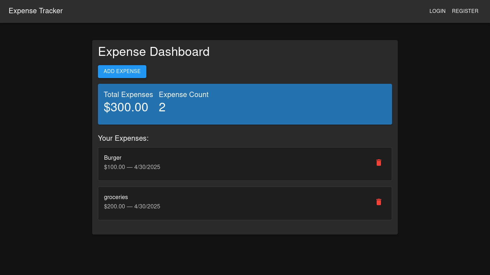
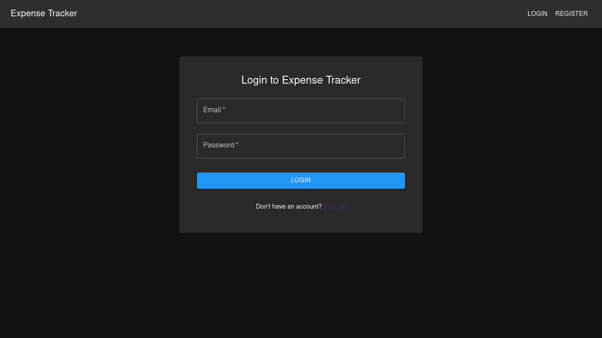
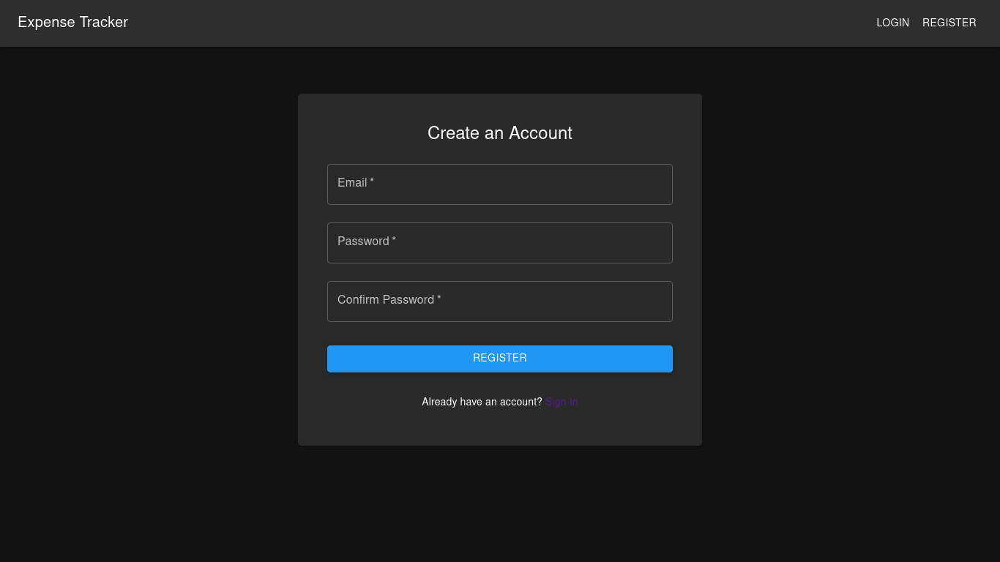
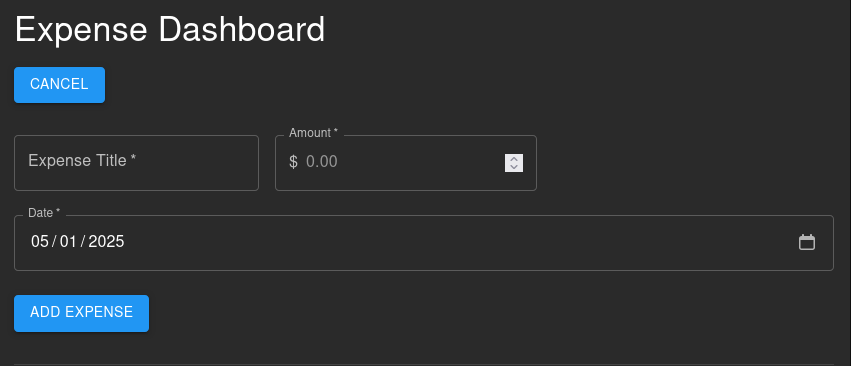

# 💸 Expense Tracker

A full-stack **Expense Management System** built with the **MERN stack (MongoDB, Express, React, Node.js)** that allows users to securely track, manage, and visualize their daily expenses. Designed with **Material Design principles** and a **dark-themed UI**, this project is both functional and user-friendly.

---
## 🖼️ Show Case






---
## 🌟 Features

- ✅ **User Authentication** (Register/Login)
- ✍️ **Add Daily Expenses** with category, amount, and date
- 📋 **View Expense History** with filters
- ☁️ **Cloud-Hosted Database** (MongoDB Atlas)
- 💾 **Persistent User Data** — access from any device
- 🌙 **Dark Themed UI** for better usability

---

## 🛠️ Tech Stack

### Frontend
- **React** (with Vite)
- **Tailwind CSS** for styling
- **Recharts** for data visualization
- **Axios** for API calls

### Backend
- **Node.js** & **Express**
- **MongoDB Atlas** (cloud database)
- **Mongoose** for data modeling
- **JWT** for secure authentication

---

## 🚀 Getting Started

### Prerequisites
- Node.js & npm
- MongoDB Atlas account

### Setup Instructions

1. **Clone the repository**
   ```bash
   git clone https://github.com/Samar-exe/expense-tracker.git
   cd expense-tracker
   ```

2. **Backend Setup**
   ```bash
   cd server
   npm install
   ```

   - Create a `.env` file with the following:
     ```env
     MONGO_URI=your_mongodb_connection_string
     JWT_SECRET=your_jwt_secret_key
     ```

   - Start the backend server:
     ```bash
     npm run dev
     ```

3. **Frontend Setup**
   ```bash
   cd ../client
   npm install
   npm run dev
   ```

4. Open your browser and visit `http://localhost:5173`


---

## 📌 Status

- ✅ Auth integration and MongoDB connectivity complete
- 📈 Expense visualizations coming soon!

---

## 🤝 Contribution

This is a college project, but feedback or improvement suggestions are always welcome. Feel free to fork the repo or open issues.

---

## 📜 License

This project is licensed under the MIT License — see the [LICENSE](LICENSE) file for details.

---

## 🤛‍♂️ Author

**Samar**  
📧 [Connect on LinkedIn](https://www.linkedin.com/in/samar-khan04/)  
💻 [More Projects](https://github.com/Samar-exe)


